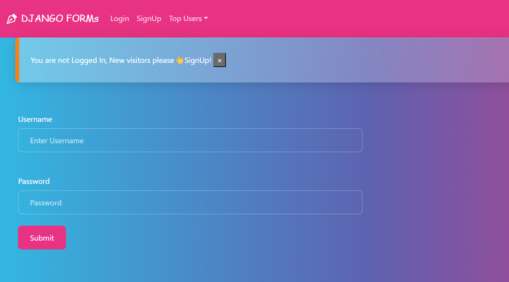
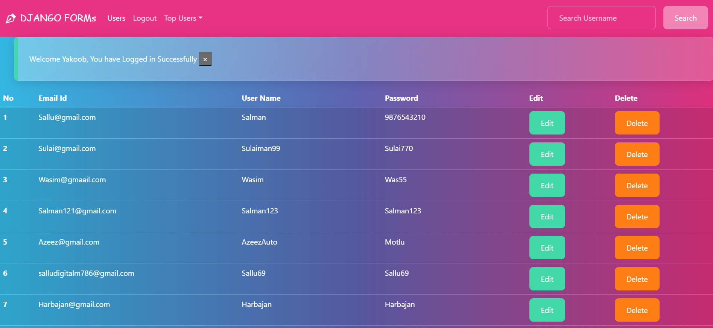

# Django Form

  
  

### 👋 Welcome to the Django Form project - repository!
This project is built on Django framework which is used for creating a signup and login form. In this project, users can create an account and log in to view all users' details. Users can also search for a specific user by entering their username in the search bar.

# 🎉View Live Project Here:
**Link: http://sallu2usermanage.pythonanywhere.com/**

# Features
### 🚀 Here are some of the key features of this project:
* **User Signup:** Users can create their own account by filling out the form with their email, username, and password. The system will check if the email and username already exist in the database before creating the account.
* **User Login:** Users can log in to view all users' details.
* **User Details:** After logging in, users can view all users' details including their email, username, and id.
* **User Search:** Users can search for a specific user by entering their username in the search bar.
* **User Edit:** Users can edit their details by clicking the edit button and entering the new details.
* **User Delete:** Users can delete their details by clicking the delete button.
* **Session timeout:** The session is set to expire in 5 minutes to ensure the user's security.
* **validation:** The form includes validation of form data and displays error messages when fields are not filled in correctly.
* **Bootstrap:** The form uses Bootstrap for styling, with custom CSS to adjust the appearance of the form.

# Setup Instructions
### 🛠️ Follow the steps below to set up this project on your local machine:
1. Clone this repository to your local machine using Git or download the ZIP file: **git clone https://github.com/Sallu-Fullstack/Django-form.git**
2. Navigate to the project directory using the command line.
3. Create a virtual environment for the project using the following command:
  **python -m venv myenv**
4. Activate the virtual environment using the following command:
  **source myenv/bin/activate**
5. Install the project dependencies using the following command:
  **pip install -r requirements.txt**
6. Run database migration to create the necessary database tables using the following command:
  **python manage.py makemigrations**
  **python manage.py migrate**
7. Start the development server using the following command:
  **python manage.py runserver**
8. Open your web browser and go to http://localhost:8000/ to see the form.
### 🎉 Congratulations, you have successfully set up the Django Form project on your local machine!

# Conclusion
**👏 Thank you for checking out the Django Form project! If you have any questions or feedback, please feel free to reach out.**
